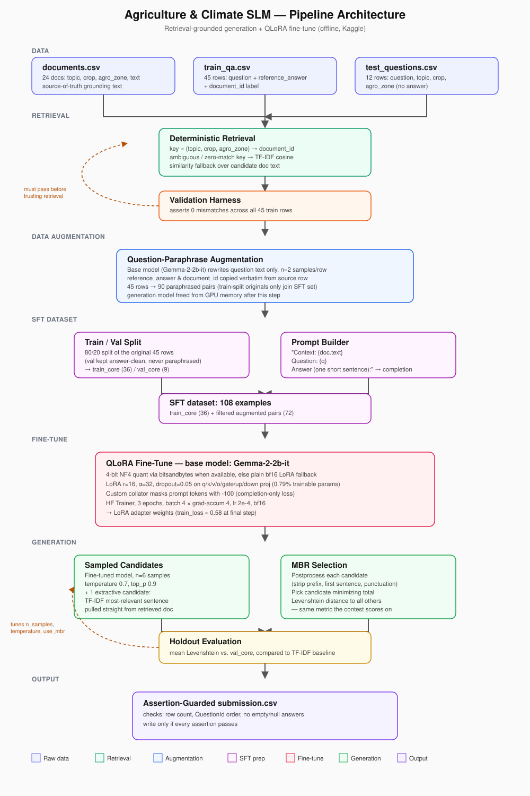

# Agriculture & Climate SLM

A retrieval-grounded, QLoRA-fine-tuned small language model that answers smallholder-farmer questions about agriculture and climate topics with terse, document-grounded answers.



## Why this approach

The benchmark's reference answers are near-verbatim one-sentence compressions of a single source document, and `(topic, crop, agro_zone)` deterministically resolves the correct document for almost every training row. Given that, the task is closer to **retrieve → compress** than **generate from parametric knowledge**. The pipeline reflects that:

1. Resolve the exact source document with a metadata join (TF-IDF similarity as a fallback for ambiguous keys).
2. Fine-tune a small instruct model (QLoRA) to compress `(context, question)` into a one-sentence answer.
3. Decode with Minimum Bayes Risk selection over sampled + extractive candidates, scored with the same metric the competition uses.

This keeps the model's job narrow — "shorten this passage to answer this question" — rather than asking it to recall agronomy facts from its own weights.

## Pipeline overview

| Stage | What happens |
|---|---|
| **Data** | Load `documents.csv` (24 docs), `train_qa.csv` (45 labeled Q&A rows), `test_questions.csv` (12 unlabeled rows) |
| **Retrieval** | Deterministic `(topic, crop, agro_zone)` → `document_id` join; TF-IDF cosine fallback for ambiguous/zero-match keys |
| **Validation** | Assert 0 mismatches against all 45 training rows before trusting retrieval on test |
| **Augmentation** | Base model (Gemma-2-2b-it) paraphrases question text only, 2 samples/row; answers and `document_id` copied verbatim — 45 → 90 pairs |
| **SFT dataset** | 80/20 train/val split of the original 45 rows (val never paraphrased); prompt = context + question, completion = reference answer |
| **Fine-tune** | QLoRA (4-bit NF4 via bitsandbytes, falls back to plain bf16 LoRA) on Gemma-2-2b-it; completion-only loss via `-100`-masked prompt tokens |
| **Generation** | Sample 6 candidates + 1 extractive candidate (most question-relevant sentence pulled directly from the retrieved doc) |
| **Selection** | Minimum Bayes Risk: pick the candidate with lowest total Levenshtein distance to all others |
| **Eval** | Mean Levenshtein on held-out split, compared against a TF-IDF nearest-question baseline |
| **Submission** | Write `submission.csv`, gated behind hard assertions (row count, ID order, no empty/null answers) |

## Repo structure

```
C10-team-kagera/
├── README.md
├── docs/
│   ├── architecture.svg               # pipeline diagram (this README)
│   ├── problem_statement.pdf
│   ├── data_card.pdf
│   ├── impact_statement_card.pdf
│   ├── stakeholder_engagement.pdf
│   └── presentation_slides.pdf        # if applicable
├── scripts/
│   └── agriculture_slm.ipynb          # end-to-end pipeline (setup → submission)
└── data/
    ├── documents.csv
    ├── train_qa.csv
    └── test_questions.csv
```

## Data

- **`documents.csv`** — 24 rows: `document_id`, `topic`, `crop`, `agro_zone`, `title`, `text`
- **`train_qa.csv`** — 45 rows: `QuestionId`, `question`, `topic`, `crop`, `agro_zone`, `document_id`, `reference_answer`
- **`test_questions.csv`** — 12 rows: `QuestionId`, `question`, `topic`, `crop`, `agro_zone`

The notebook auto-discovers the data directory by searching for `train_qa.csv` under `/kaggle/input`, `/content/`, then `./` — it runs unmodified on Kaggle, Colab, or locally.

## Retrieval

`(topic, crop, agro_zone)` uniquely resolves 23 of 24 documents. The one ambiguous key (`livestock`/`livestock`/`sub_humid`) and any zero-match combination at test time fall back to TF-IDF cosine similarity between the question and candidate document text. This is validated against all 45 training rows before being trusted on the hidden test set — the notebook asserts 0 mismatches.

## Fine-tuning

- **Base model:** Gemma-2-2b-it, resolved from an offline Kaggle "Models" input (falls back to the Hub string when internet is available)
- **Method:** LoRA, `r=16`, `alpha=32`, `dropout=0.05`, targeting `q/k/v/o/gate/up/down_proj` (0.79% trainable params)
- **Quantization:** 4-bit NF4 via `bitsandbytes` when available; otherwise plain bf16 LoRA — the run degrades gracefully rather than failing on an offline image missing `bitsandbytes`
- **Loss masking:** a custom collator masks prompt tokens with `-100`, reproducing completion-only loss without depending on `trl` (not reliably present in Kaggle's offline base image)
- **Training:** `transformers.Trainer`, 3 epochs, batch size 4 × grad-accum 4, lr `2e-4`, bf16
- **Result:** train loss ≈ 0.58 at the final logged step

## Generation & decoding

Each test question is decoded with Minimum Bayes Risk selection rather than a single greedy pass:

1. Sample 6 candidate answers from the fine-tuned model (temperature 0.7, top-p 0.9).
2. Add one extractive candidate — the sentence in the retrieved document most similar to the question by TF-IDF.
3. Post-process every candidate (strip prompt echoes, keep the first sentence, normalize terminal punctuation).
4. Select the candidate with the lowest total Levenshtein distance to all other candidates, using the model's own output distribution as a proxy for "closest to the true reference" — scored with the exact metric the competition uses.

## Evaluation

A local Levenshtein harness reproduces the competition metric offline. The fine-tuned model is checked against a TF-IDF nearest-question baseline on the held-out split before generating test predictions, so a regression is caught before submission rather than after.

## Submission

`submission.csv` is only written if every one of these holds:

- row count matches `test_questions.csv`
- `QuestionId` order matches `test_questions.csv`
- every `Answer` is non-empty
- no `Answer` is null

## Running it

```bash
pip install -r requirements.txt   # transformers, peft, bitsandbytes, accelerate, scikit-learn, datasets
jupyter notebook scripts/agriculture_slm.ipynb
```

The notebook is self-contained: it installs missing packages (with a timeout so an offline environment doesn't hang), resolves the data directory, validates retrieval, augments, fine-tunes, evaluates, and writes `submission.csv` in one run.

## Project documentation

Supporting project docs live in `docs/`:

- [`problem_statement.pdf`](docs/problem_statement.pdf) — the problem this project addresses
- [`data_card.pdf`](docs/data_card.pdf) — dataset provenance, composition, and limitations
- [`impact_statement_card.pdf`](docs/impact_statement_card.pdf) — intended use and impact
- [`stakeholder_engagement.pdf`](docs/stakeholder_engagement.pdf) — stakeholder input and feedback
- [`presentation_slides.pdf`](docs/presentation_slides.pdf) — project presentation (if applicable)

## Design notes / trade-offs

- **Why paraphrase augmentation instead of synthetic Q&A generation:** generating new question–answer pairs risks the answer drifting from its grounding document. Paraphrasing only the question side keeps every `reference_answer` and `document_id` verified and untouched.
- **Why held-out validation never sees paraphrases:** the original 45 rows are the closest proxy to the hidden test distribution; validating against paraphrased data would overstate performance.
- **Why MBR + an extractive candidate:** reference answers are near-verbatim document extracts, so the single most question-relevant sentence from the source document is a strong candidate in its own right, not just a generation prompt.
